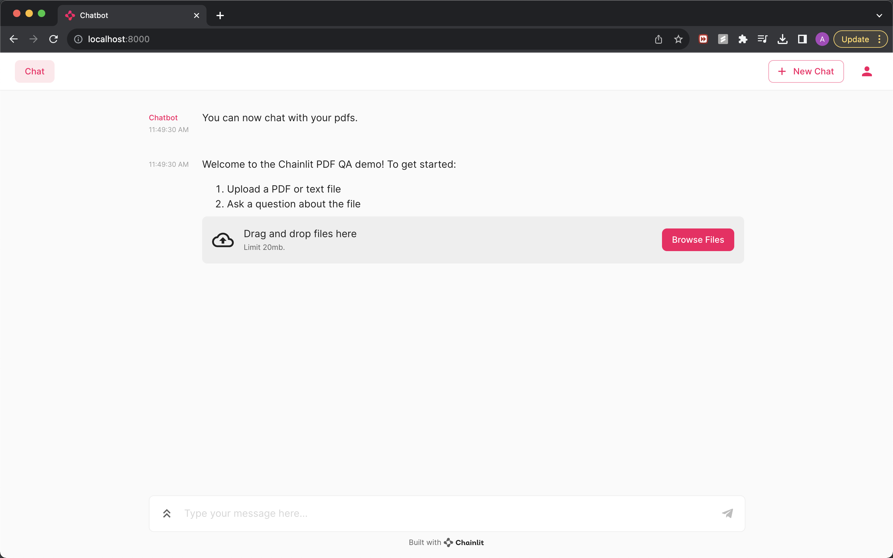

This Project uses Chainlit, Chroma DB and GPT to perform question answering on a selected document. The model also returns the section of input document which was the most similar to the input query. 

